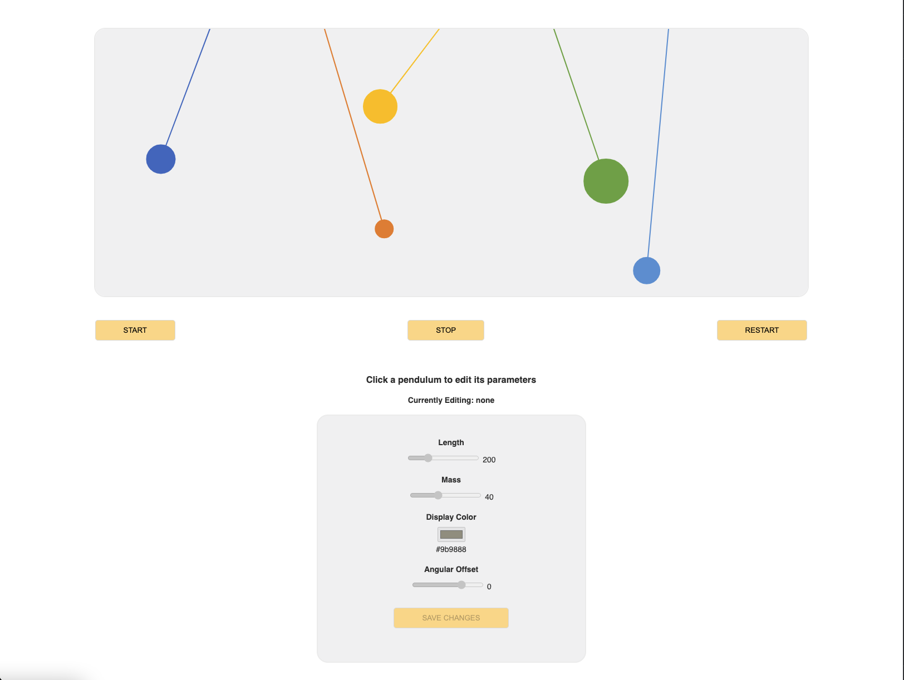
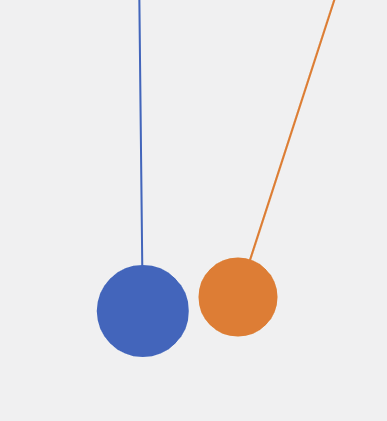

# Simple Pendulum

This codebase represents a simple pendulum animation, backed by N number of Node/Express instances that actively track the movements, store the underlying configuration, and implement collision detection between pendulums.

## How to run 

You will need the following installed and accessible via your `PATH` variable globally:

- `docker`
- `pm2` 

Kindly make sure the following ports are free and available on your machine:

- `3001`
- `3002`
- `3003`
- `3004`
- `3004`
- `8080`
- `6379`

First, rename the file `.env.sample` to `.env` as both the express application and docker instance uses it. You do not need to change any values, unless you are using existing docker containers. You can specify a value of `REDIS_PASSWORD` if you'd like to, otherwise the present one is used by default.

In order to run the application, start the docker instance:

```
npm run docker
```

You can now fire all 5 pendulum instances using the following command:

```
npm run run:all
```

and that's it. You can now open `./src/views/index.html` in your browser and it will be ready to proceed.

I will also recommend to open up a new terminal instance and run the following to view logs in real-time for all instances:

```
pm2 logs
```

## How to configure & use

You will notice the following screen upon visting the web page:



Each pendulum receives a default configuration with color, length, mass, angular offset to match the requirement document.

You can use the **Start**, **Stop**, **Restart** buttons to play the animation.

In order to configure each instance, you can click on the respective pendulum and use the modal provided at the bottom of the page to configure its value.

**Important:** In order to persist your changes to a pendulum in the backend, you need to hit **Save Changes**. Otherwise, the pendulum is edited within your browser only and the configuration is lost when you restart the project.

# Demos

A few video demos of this application:

## Start, Stop, Restart

[YouTube - Start, Stop, Restart](https://www.youtube.com/watch?v=DXhJdve8tIE)

## Edit Pendulum Configuration

[YouTube - How to configure](https://www.youtube.com/watch?v=4sJz6qw2xVs)

## Collision Detection

[YouTube - Collision Detection](https://www.youtube.com/watch?v=I5AjZCsSpPY)

# Architecture

1. The REST API is done using Node & Express. 
2. The REST API is spawned into 5 different instances using **pm2**.
3. Redis is used to persist the configuration of the pendulums, and also track their positions. 
4. The frontend uses plain JavaScript and CSS, along with libraries: `p5.js`, `sketch.js` and `axios` to render the pendulum and make HTTP requests. 
5. WebSockets are used to implement a communication relay channel between the REST API and frontend. As of now, this is used to communicate collision detection to frontend, and all other instances.
6. The REST APIs do not implement any authentication mechanism **on purpose** because the entire application is running locally as of now.

### Pendulum Instances

Each pendulum instance is represented by a TCP port. The ports are as following:

- `localhost:3001`
- `localhost:3002`
- `localhost:3003`
- `localhost:3004`
- `localhost:3005`

There is a sandbox environment running at `localhost:3000` that is used for testing purposes.

Each instance is informed about its immediate neighbour using `.env` variable `INSTANCE_NEIGHBOR`. Only the port is passed. 

Here is a sample command used to start a single instance:

`PORT=3001 INSTANCE_NEIGHBOR=3002 pm2 start ./src/index.js --name \"instance-3001\"`

### Tracking Position & Configuration

The API implements a REST interface that is used to track information about the pendulum. Every `500ms`, the position `(x,y)` of each pendulum instance is sent to the respective pendulum instance using a `POST` request to the following endpoint:

```
POST http://localhost:<instance-port>/v1/pendulum/position
```

Upon receiving the request, the instance persists the information in Redis using a key specific to that instance. 

This information can be retrieved any time by calling the following API endpoint:

```
GET http://localhost:<instance-port>/v1/pendulum/position
``` 

which returns the following object:

```
{
    x: <x value of position vector>,
    y: <y value of position vector>
}
```

It can be used to represent pendulum in an external process.

The configuration of a pendulum can be retrieved at any time using the following endpoint. It represents information such as:

- length 
- mass
- initial angular offset
- wind factor 

```
GET http://localhost:<instance-port>/v1/pendulum/config
```

Configuration for any pendulum can be added as well using the same endpoint with `POST` http method.

In order to view complete documentation of the REST API, please refer to this document.

### Collision Detection 

Whenever position for a single pendulum instance is received, we compute the difference between the `x` and `y` vector values of the present pendulum instance, and its neighbor. 

If the difference is less than a specific threshold, a `STOP` signal is issued via WebSockets and broadcasted to all clients. The frontend, being one of the clients, receives the messsage and immediately stops the animation.

Using `setTimeout`, a `RESTART` signal is scheduled simultaneously that is also received by all the clients. Upon receiving it, the frontend resets the animation to its initial stage.

For a collision to happen, the pendulums need to be in close proximity with respect to both their `x` and `y` axis. If a pendulum simply touches or comes in close proximity to the string of another pendulum, it is not considered a collision by design.



# Factors that can be improved

There was plenty of time to execute on the assignment from Vention's side, but due to time constraints on my end, I could not introduce certain practices that I would normally do. These are highlighted here.

1. Specify collision threshold for each pendulum instance via the `.env` file, rather than hard coding it. 

2. Move the initial configuration for pendulums from the pendulum service, to an external config file rather than keeping it in the pendulum service as it is right now.

3. Implement wind factor by updating the angular offset of each pendulum relative to its length & mass. This will cause the pendulum to swing and act if an external one-directional wind is acting upon it. Due to time constraints on my end, I couldn't get to this point.

4. Use a JS config file in frontend to specify values such as host, ports etc. Most of this information is specified in the same file as the logic, which is not a good practice.

5. Use a npm package like `serve` to run frontend on its own dedicated port, rather than running the html file via the browser.

6. Implement auto-save when editing pendulum and eliminate **Save Changes** button.